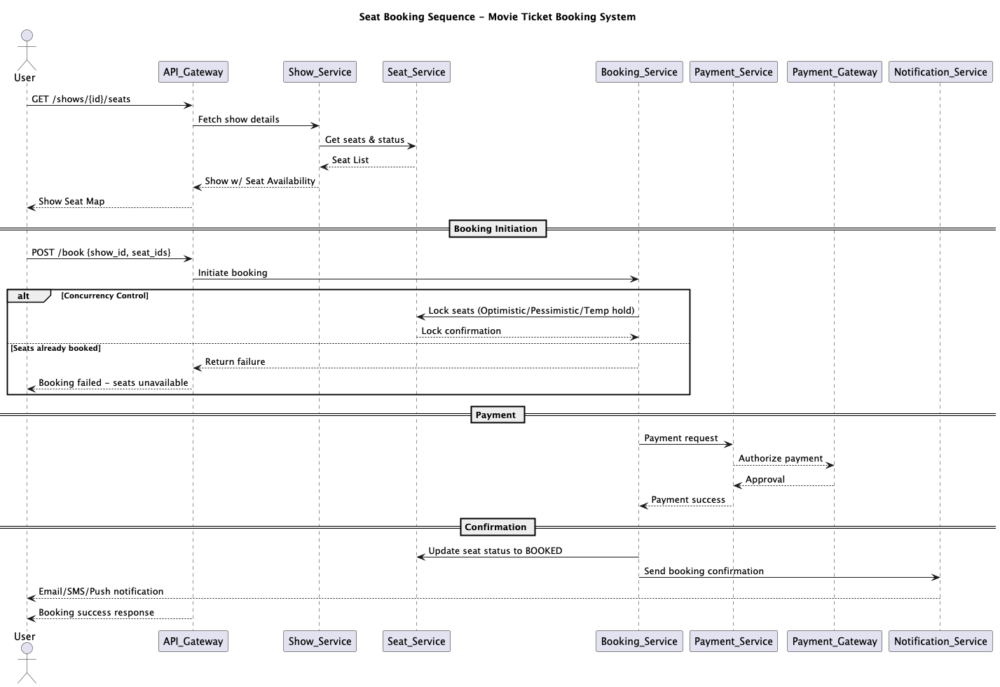

# 🎬 Movie Ticket Booking System – HLD/LLD Notes

## 1. Functional Requirements (Must-have)
1. User should **view movie details based on theater** (Cast, timings, screen, ratings, etc.).
2. User should **book one or many seats** in a single transaction.
3. User should be able to **make payments** for bookings.
4. User should be able to **cancel bookings**.
5. User should be able to **view previous booking history**.
6. User should be able to **see/update their profile**.
7. Once a ticket is booked, system should **send confirmation/failure notification** (via message/email).

---

## 2. Non‑Functional Requirements (NFR)
1. **High availability**
2. **Scalability** (horizontal & vertical)
3. **Low latency**
4. **High throughput**
5. **Security** (payment, PII protection, secure APIs)

---

## 3. Key Components / Modules
1. **User Service** – manages `user_id`, `username`, `profile`, `address`.
2. **Seat Management Service** – manages `seat_id`, `status`, pricing.
3. **Show Management Service** – manages `show_id`, `start_time`, `end_time`, linked to movie & theater.
4. **Theater Service** – manages `theater_id`, name, location, number of screens.
5. **Movie Service** – manages `movie_id`, name, cast, genre, duration.
6. **Booking Service** – handles booking workflow, payments, cancellations.
7. **Notification Service** – sends emails/SMS/Push notifications.

---

## 4. Flow / Sequence (HLD)
**Example booking flow:**
1. User calls `GET /theaters` → system returns theaters with movies.
2. User selects movie & show → system displays seats with `status` & `price`.
3. User calls `POST /book` with chosen seats → Seat(s) are locked.
4. Payment service processes payment request.
5. On success → booking is confirmed & seat status updated → Notification service triggers an email/SMS.
6. On failure → seat lock is released.

**High Level Diagram:**
```text
User → Theater Service → Movie Service → Show Service → Seat Service
   ↓
Booking Service → Payment Service → Notification Service
```

---

## 5. Architecture Diagram

```text
                ┌────────────────┐
                │   User (Web/Mobile App) │
                └───────┬────────┘
                        │
              ┌─────────▼─────────┐
              │   API Gateway /   │
              │  Load Balancer    │
              └─────────┬─────────┘
                        │
       ┌────────────────┼────────────────┐
       │                │                │
┌──────▼─────┐   ┌──────▼─────┐   ┌──────▼─────┐
│ Theater    │   │ Movie      │   │ Show       │
│ Service    │   │ Service    │   │ Service    │
└──────┬─────┘   └──────┬─────┘   └──────┬─────┘
       │                │                │
       │                │                │
       └──────┬─────────┼────────────────┘
              │
       ┌──────▼─────┐
       │ Seat Mgmt  │
       │ Service    │
       └──────┬─────┘
              │
       ┌──────▼──────────────────────────┐
       │ Booking Service                  │
       │  - Booking Workflow              │
       │  - Lock Handling (Optimistic /   │
       │    Pessimistic / Temporary)      │
       └──────┬──────────────────────────┘
              │
 ┌────────────▼───────────────┐
 │ Payment Service             │
 │  Integration with Gateway   │
 └────────────┬───────────────┘
              │
 ┌────────────▼───────────────┐
 │ Notification Service        │
 │  (Email/SMS/Push)           │
 └────────────┬───────────────┘
              │
      ┌───────▼────────┐
      │ SQL Database   │
      │ (Postgres/MySQL)
      │ Users, Seats,
      │ Shows, Bookings│
      └────────────────┘

-- Optional Components --
- Cache (Redis) for seat availability
- Message Queue (Kafka/SQS) for async comms
```

-----

## 6. Data Model (Simplified)
- **User**(`user_id`, `username`, `profile`, `address`)
- **Movie**(`movie_id`, `name`, `cast`, `duration`)
- **Theater**(`theater_id`, `name`, `location`)
- **Show**(`show_id`, `movie_id`, `theater_id`, `start_time`, `end_time`)
- **Seat**(`seat_id`, `show_id`, `seat_number`, `status`, `price`)
- **Booking**(`booking_id`, `user_id`, `show_id`, `total_amount`, `status`)
- **BookedSeat**(`booking_id`, `seat_id`)

**Database Choice:**  
Structured data → SQL (e.g., **PostgreSQL** / **MySQL**)

CAP Consideration → Trade-off between **Consistency** and **Availability** for seat booking.

---

## 7. API Endpoints (Sample)
- `GET /theaters`
- `GET /theaters/{id}/movies`
- `GET /movies/{id}/shows`
- `GET /shows/{id}/seats`
- `POST /book`
- `POST /payment`
- `POST /cancel/{booking_id}`
- `GET /users/{id}/bookings`
- `PUT /users/{id}/profile`

---

## 8. Concurrency & Locking Strategy
To ensure seats are not oversold in concurrent bookings:
1. **Optimistic Locking**
    - Versioning column in `Seat` table.
    - Detect conflicts on update and retry. (Good for read-heavy workloads)
2. **Pessimistic Locking**
    - Lock row upfront:
      ```sql
      SELECT * FROM seat 
      WHERE id = X AND show_id = Y 
      FOR UPDATE;
      ```
    - Good for write-heavy, high contention.
3. **Temporary Lock (Seat Hold)**
    - Lock seats for a certain time (e.g., 5 mins) during payment.
    - If payment fails → release seats.

---

## 9. Trade-offs
- **Consistency vs Availability:** In a distributed booking system, strict consistency is critical for seat inventory, so may prefer CP in CAP theorem.
- **Lock strategy:** Pessimistic lock ensures correctness but reduces throughput; Optimistic improves performance but requires retries.
- **Scalability:** Use caching (Redis) for show/seat availability to reduce DB load.
- **Failover:** Implement retries and idempotent booking APIs to handle failures gracefully.

---

## 10. Sequence Diagram


----

## 11. Possible Improvements
- Add **Seat Hold Service** with expiry for cart-like behavior.
- Use **message queues** (Kafka/SQS) for async notifications.
- Integrate **payment gateway** with distributed transaction handling (saga pattern).
- Shard data by **theater_id** or **region** for massive scale.