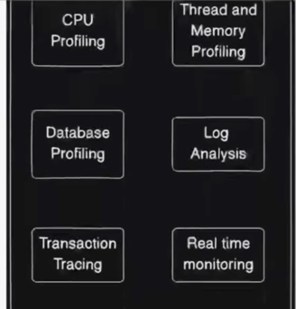
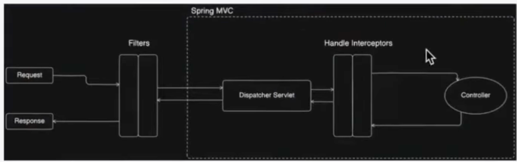

# 📚 Table of Contents

1. [How can you validate two specific conditions in a YAML property file while creating a bean in a SpringBoot Application?](#-how-can-you-validate-two-specific-conditions-in-a-yaml-property-file-while-creating-a-bean-in-a-springboot-application)
2. [Your SpringBoot application is facing Performance issue under high load. What steps would you take to diagnose and resolve the problem?](#-your-springboot-application-is-facing-performance-issue-under-high-load-what-steps-would-you-take-to-diagnose-and-resolve-the-problem)
3. [How do you improve your API performance by X%?](#how-do-you-improve-your-api-performance-by-x)
4. [How would you scale your springboot application to handle increased traffic and what spring boot feature can assist with this?](#-how-would-you-scale-your-springboot-application-to-handle-increased-traffic-and-what-spring-boot-feature-can-assist-with-this)
5. [How do you manage transactions in a Spring Boot Application? and what code is running internally when using the 
   @Transactional annotation](#-how-do-you-manage-transactions-in-a-spring-boot-application-and-what-code-is-running-internally-when-using-the-transactional-annotation)
6. [How can you deploy a small Spring Boot application cost-effectively, ensuring that you only pay for server 
   resources when the application is in use?](#-how-can-you-deploy-a-small-spring-boot-application-cost-effectively-ensuring-that-you-only-pay-for-server-resources-when-the-application-is-in-use)
7. [How would you handle multiple beans of the same type in Spring Boot?](#-how-would-you-handle-multiple-beans-of-the-same-type-in-spring-boot)
8. [We do not want a dependency to be auto-configured by AutoConfiguration in a Spring Boot Application, what steps do 
   we need to take to achieve this requirement?](#-we-do-not-want-a-dependency-to-be-auto-configured-by-autoconfiguration-in-a-spring-boot-application-what-steps-do-we-need-to-take-to-achieve-this-requirement)
9. [Implementing logging of incoming requests before controller processing in Spring Boot](#-you-are-developing-a-spring-boot-application-that-handles-user-requests-to-access-a-set-of-apis-you-need-to-implement-a-logging-mechanism-that-captures-the-details-of-incoming-requests-like-url-http-method-and-request-body-before-the-controller-processes-them-how-to-achieve-that-in-spring-boot)
10. [In a Spring Boot application, you need to ensure that all service methods annotated with `@Transactional` are 
   logged with the execution time taken by each method. How would you implement this in Spring Boot?](#-in-a-spring-boot-application-you-need-to-ensure-that-all-service-methods-annotated-with-transactional-are-logged-with-the-execution-time-taken-by-each-method-how-would-you-implement-this-in-spring-boot)
11. [You are tasked with securing certain endpoints in a Spring Boot application so that only users with specific roles 
    can access them. Users authenticate via tokens that include their roles as claims. How would you configure your application to ensure that access to these endpoints is restricted based on user roles, and that the role checks are applied to method-level security in your controllers or services](#-you-are-tasked-with-securing-certain-endpoints-in-a-spring-boot-application-so-that-only-users-with-specific-roles-can-access-them-users-authenticate-via-tokens-that-include-their-roles-as-claims-how-would-you-configure-your-application-to-ensure-that-access-to-these-endpoints-is-restricted-based-on-user-roles-and-that-the-role-checks-are-applied-to-method-level-security-in-your-controllers-or-services)
12. [How can you handle exceptions globally in a Spring Boot application?](#-how-can-you-handle-exceptions-globally-in-a-spring-boot-application)
13. [IoC vs Dependency Injection vs Dependency Inversion](#-ioc-vs-dependency-injection-vs-dependency-inversion)
14. [How does SpringBootApplication runs](#-how-does-springapplication-works-functionality-of-springbootapplication)
15. [Spring Scheduler Explanation and Q&A](#-spring-scheduler--explanation--interview-qa)
16. [Resilience4j Patterns – Circuit Breaker, Retry, Rate Limiter, Bulkhead, Time Limiter, Cache](#-resilience4j-patterns--circuit-breaker-retry-rate-limiter-bulkhead-time-limiter-cache)
17. [Component vs Bean - when to use what](#-component-vs-bean--when-to-use-what)
18. [What happens if a Spring Bean has a private constructor](#-what-happens-if-a-spring-bean-has-a-private-constructor)
19. [@Component, @Service, @Repository - Difference](#-difference-between-component-service-and-repository-in-spring)


---


## 🔹 How can you validate two specific conditions in a YAML property file while creating a bean in a SpringBoot Application?

- **@ConditionalOnExpression**
    
    When bean needs to be created based on some non-boolean value
    ```java
    @Bean
    @ConditionalOnExpression(
        "'${app.mode}'=='DEV' and '${app.feature}'=='ENABLED'"
    )
    public MyService myService() {
        return new MyService();
    }
    ```

- **@ConditionalOnProperty**

    When bean needs to be created based on some boolean value from YAML file.
    ```java
    @Bean
    @ConditionalOnProperty(
        name = {"feature.enabled", "feature.beta"},
        havingValue = "true",
        matchIfMissing = false
    )
    public BetaFeatureService betaFeatureService() {
        return new BetaFeatureService();
    }
    ```

## 🔹 Your SpringBoot application is facing Performance issue under high load. What steps would you take to diagnose and resolve the problem?



1.**Identify Symptoms & Scope**  
   - Check logs for error spikes, slow API responses, or thread pool exhaustion.
   - Observe CPU, memory, and heap usage patterns.

2. **Enable Detailed Monitoring**
   - Use **Spring Boot Actuator** endpoints (`/metrics`, `/health`, `/threaddump`) for real-time insight.
   - Integrate APM tools (e.g., **New Relic**, **AppDynamics**, **Datadog**, **Prometheus + Grafana**) to track service performance.
   
3. **Profile the Application**
   - Use profilers (**VisualVM**, **JProfiler**, **YourKit**) to detect bottlenecks in code execution.
   - Analyze garbage collection behavior (`-Xloggc` / GC logs).

4. **Database Performance Checks**
   - Enable SQL logging (`spring.jpa.show-sql=true`) in non-prod.
   - Identify long-running queries via DB monitoring tools or adding indexes where needed.
   - Implement connection pooling (e.g., **HikariCP**) with tuned settings.

5. **Thread Pool and Async Tasks**
   - Review `@Async`, web, and executor thread pool configurations.
   - Ensure long-running tasks do not block request-handling threads.

6. **Caching Strategies**
   - Use caching for frequently accessed data (**Spring Cache**, Redis, or Caffeine).
   - Optimize expensive computations with `@Cacheable`.

7. **Configuration & Network**
   - Tune JVM heap size for sufficient allocation.
   - Review API gateway and load balancer configurations.
   - Consider compression and pagination to reduce payload size.

8. **Load Testing & Benchmarking**
   - Simulate high load using tools like **JMeter**, **Gatling**, or **k6**.
   - Benchmark critical APIs and track changes with profiling.

9. **Optimize Code**  
   - Refactor inefficient loops, bulky objects, or repeated queries.
   - Use asynchronous/event-driven approaches for non-blocking tasks.

10. **Scaling**
    - Implement horizontal scaling (add more application instances).
    - Use Kubernetes or cloud auto-scaling features.
    - Enable HTTP connection pooling and proper timeouts.

💡 **Tip:** Always reproduce the issue in a staging environment before applying fixes in production!

## 🔹How do you improve your API performance by X%?

My application is heavily dependent on **database** and **event-driven architecture (Kafka)**.  
To improve API performance significantly, we focused on end-to-end optimization across four major layers — **Database**, **Application**, **Kafka**, and **Infrastructure**.

---

### **1. Database Optimization**
- **Query Tuning & Indexing** – Identified and optimized slow-running queries using query analysis tools and introduced appropriate indexes to minimize full table scans.
- **Query Node vs Data Node Separation** – At the infrastructure level, we isolated query nodes from data nodes, which helped balance load and improve parallel query performance.
- **Selective Field Fetching (Sub-Doc Implementation)** – Replaced `SELECT *` with selective field retrieval to reduce payload size and processing overhead.
- **Join Optimization** – Sub-queries were refactored into efficient `JOIN` operations where applicable, significantly reducing computation cost.
- **Sharding & Partitioning** – Distributed large datasets across multiple nodes to parallelize query execution and reduce latency.

---

### **2. Application-Level Optimization**
- **Asynchronous Processing** – Decoupled heavy synchronous flows (like logging, notifications) using `CompletableFuture` and asynchronous Kafka consumers to speed up request-response cycles.
- **Parallel Stream Processing** – Leveraged `ParallelStream` for CPU-bound data transformations and batch processing where order wasn’t critical, improving throughput.
- **Optimized Object Mutability** – Converted frequently modified immutable objects to mutable ones to reduce unnecessary object creation and garbage collection overhead.
- **Caching with TTL** – Introduced caching (e.g., Redis, Caffeine) for static and configuration data using appropriate TTLs to reduce repetitive database hits.
- **Connection Pool Tuning** – Tuned thread pools (`@Async` executors) and HikariCP settings (`maximumPoolSize`, `connectionTimeout`) for optimal resource utilization.

---

### **3. Kafka Optimization**
- **Partition Key Strategy** – Revisited event key generation to ensure even distribution of messages across Kafka partitions, avoiding hotspot partitions.
- **Batch & Compression Configurations** – Tuned producer properties like `batch.size`, `linger.ms`, and `compression.type` to optimize message throughput.
- **Consumer Lag Monitoring** – Enabled continuous monitoring using Kafka Lag Exporter and Prometheus to detect bottlenecks early and scale consumers dynamically.

---

### **4. Infrastructure-Level Optimization**
- **Profiling & Monitoring** – Performed CPU and memory profiling to identify bottlenecks. Based on analysis:
    - For **I/O-bound** workloads → implemented **horizontal scaling** (more instances)
    - For **Memory/CPU-intensive** workloads → improved **vertical scaling** (increased instance specs)
- **JVM Optimization** – Analyzed heap and non-heap usage using tools like VisualVM and JConsole to right-size JVM parameters (`-Xms`, `-Xmx`, GC tuning).
- **Thread Management** – Monitored thread utilization to fine-tune concurrency levels and prevent thread starvation.
- **Load Testing** – Re-ran benchmark tests (JMeter, Gatling) post-optimization to validate measurable performance gains.

---

### **📈 Outcome**
After applying the above optimizations:
- Reduced average API latency by over **40%**
- Improved throughput (TPS) by **~50%**
- Ensured consistent performance under high-load scenarios through better concurrency, caching, and resource scaling

💡 **Takeaway:**  
End-to-end performance optimization is about **measuring, identifying key bottlenecks, applying targeted fixes**, and **revalidating through benchmarking** across code, infra, and data layers.

## 🔹 How would you scale your springboot application to handle increased traffic and what spring boot feature can assist with this?

When scaling a Spring Boot application to handle increased traffic, you should combine **system design scaling strategies** with **Spring Boot performance optimization features**.

---

### **1. Horizontal Scaling**
- **Definition:** Adding more instances of your application to handle traffic by distributing requests.
- **How to Implement:**
    - Deploy multiple stateless instances of the application.
    - Use a load balancer (e.g., **NGINX**, **AWS ALB**, **GCP Load Balancer**).
    - Container orchestration platforms like **Kubernetes** or **Docker Swarm** can manage scaling automatically based on traffic.
- **Usage Scenario:** Best for microservices or stateless apps where load can be spread evenly.

---

### **2. Vertical Scaling**
- **Definition:** Increasing the resources (CPU, memory, disk I/O) of your existing servers/nodes.
- **How to Implement:**
    - Upgrade your cloud instance to a higher tier (AWS EC2, Azure VM, GCP Compute Engine).
- **Usage Scenario:** Quick fix but limited by hardware capabilities.

---

### **3. Asynchronous Processing**
- **Spring Boot Feature:** Use the `@Async` annotation to run long-running methods in separate threads.
- **Example:**
```java
@Async
public void processOrder(Order order) {
    // Time-consuming order processing logic
}
```

---

### **4. Caching**
Caching reduces repetitive database hits and speeds up API responses by storing frequently accessed data in memory.

#### **Key Annotations in Spring Boot:**
- **@Cacheable**  
  - Caches the result of a method so subsequent calls with the same parameters return the cached value instead of executing the method again.
```java
@Cacheable(value = "orders")
public List<Order> getOrders() {
    // This will fetch from DB only if "orders" cache is empty
    return orderRepository.findAll();
}
```

- **@CacheEvict**
    - Removes outdated cache entries after data changes.
    - This is useful when cached data becomes stale after an update or delete.
    - Supported Providers: Redis, Caffeine, EhCache, Hazelcast, etc.
```java
@CacheEvict(cacheNames = {"order", "orders"}, allEntries = true, key = "#id")
public void updateOrder(String id, Order updatedOrder) {
    orderRepository.save(updatedOrder);
}
```

---

### **5. Summary Table**
| Scaling Strategy         | Spring Boot Feature / Tool              | Purpose                                                                 |
|--------------------------|-----------------------------------------|-------------------------------------------------------------------------|
| Horizontal Scaling       | Infrastructure (Kubernetes, Load Balancer) | Distribute traffic across multiple application instances               |
| Vertical Scaling         | Infrastructure Upgrade                  | Increase server capacity (CPU, RAM, network)                           |
| Asynchronous Processing  | `@Async` annotation                     | Process tasks in parallel without blocking request threads             |
| Caching                  | `@Cacheable`, `@CacheEvict`             | Reduce database load & improve response speed by storing frequent data |

**✅ Recommendation:** Combine **Horizontal Scaling** with **Asynchronous Processing** and **Caching** for optimal performance under high traffic.


## 🔹 How do you manage transactions in a Spring Boot Application? and what code is running internally when using the @Transactional annotation

### **Managing Transactions in Spring Boot**
Spring Boot supports declarative transaction management using the **`@Transactional`** annotation from Spring Framework.  
This annotation works at the **service layer** to ensure **ACID properties** (Atomicity, Consistency, Isolation, Durability) in database operations.

---

### **Usage Example**
```java
@Service
public class PaymentService {

    @Transactional
    public void processPayment(Order order, Payment payment) {
        orderRepository.save(order);
        paymentRepository.save(payment);

        // If any runtime exception occurs here, both saves will be rolled back
    }
}
```

### **How It Works Internally**
When Spring encounters the `@Transactional` annotation:

1. **Proxy Creation**  
   - Spring creates a proxy for the annotated class or method (using **JDK dynamic proxy** if implementing an interface, or **CGLIB** if it's a concrete class).  
   - This proxy intercepts method calls to wrap them in transaction boundaries.

2. **Method Interception**  
   - The proxy delegates control to Spring's **TransactionInterceptor**, which decides when to open and close a transaction.

3. **Transaction Management**  
   - The underlying **PlatformTransactionManager** (e.g., `DataSourceTransactionManager` for JDBC, `JpaTransactionManager` for JPA/Hibernate) begins a transaction before method execution.
   - Business logic executes inside this transaction context.

4. **Commit / Rollback Logic**
   - If the method completes successfully, the transaction manager **commits** the transaction.
   - If a `RuntimeException` or `Error` occurs, it **rolls back** the transaction by default (checked exceptions do not trigger rollback unless configured via `rollbackFor`).

---

### **Key Points**
- **Default Rollback Behavior:**  
  - Rolls back on `RuntimeException` and `Error` by default.  
  - Checked exceptions (`Exception`) require explicit `rollbackFor`.

- **Propagation Behavior:**  
  - Controls how transactions propagate when calling other transactional methods (`REQUIRED`, `REQUIRES_NEW`, `MANDATORY`, etc.).

- **Isolation Levels:**  
  - Defines data visibility in concurrent transactions (`READ_COMMITTED`, `REPEATABLE_READ`, `SERIALIZABLE`, etc.).

- **Timeout Settings:**  
  - Ensures a transaction is rolled back if not completed within the defined time limit.

```java
@Transactional(
    rollbackFor = {SQLException.class},
    noRollbackFor = {IllegalArgumentException.class},
    isolation = Isolation.READ_COMMITTED,
    propagation = Propagation.REQUIRED,
    timeout = 30
)
public void customTransactionMethod() {
    // Your logic here
}
```

---

### **Internal Pseudo-Code Flow**
```java
TransactionStatus status = transactionManager.getTransaction(new DefaultTransactionDefinition());

try {
    // Execute target method
    targetMethod();

    transactionManager.commit(status);  // Commit on success
} catch (RuntimeException | Error ex) {
    transactionManager.rollback(status); // Rollback on failure
    throw ex; // Rethrow the exception
}
```

---

### **Propagation Behaviors in `@Transactional` Annotation**

In Spring, **transaction propagation** defines how the existing transaction context is handled when a transactional method is called **inside another transactional context**.  
It is configured via the `propagation` attribute in `@Transactional`.

---

#### **1. REQUIRED (Default)**
- **Behavior:** Use the **existing transaction** if one exists; otherwise, create a **new transaction**.
- **Usage:** Most common — works well in most business operations.
- **Example:**  
```java
@Transactional(propagation = Propagation.REQUIRED)
public void methodA() {
    // Uses existing transaction or starts new if none exists
}
```

#### **2. REQUIRES_NEW**
- **Behavior:** Always **create a new transaction**, suspending the current one if it exists.
- **Usage:** For operations that must always run in their own transaction.
- **Example:**  
```java
@Transactional(propagation = Propagation.REQUIRES_NEW)
public void methodB() {
    // Always starts a new transaction
}
```

#### **3. SUPPORTS**
- **Behavior:** Execute in the current transaction if one exists, otherwise execute non-transactionally.
- **Usage:** For read-heavy operations that can work without a transaction.
- **Example:**  
```java
@Transactional(propagation = Propagation.SUPPORTS)
public void methodC() {
    // Runs in current transaction or outside transaction
}
```

#### **4. NOT_SUPPORTED**
- **Behavior:** Execute non-transactionally, suspending the current transaction if it exists.
- **Usage:** For operations that should never run in a transaction.
- **Example:**  
```java
@Transactional(propagation = Propagation.NOT_SUPPORTED)
public void methodD() {
    // Runs without transaction
}
```

#### **5. MANDATORY**
- **Behavior:** Must run in an existing transaction; throws an exception if none exists.
- **Usage:** For operations that must be part of an existing transaction.
- **Example:**  
```java
@Transactional(propagation = Propagation.MANDATORY)
public void methodE() {
    // Must be in an existing transaction
}
```

#### **6. NEVER**
- **Behavior:** Must not run in a transaction; throws an exception if one exists.
- **Usage:** For operations that cannot run in a transaction.
- **Example:**  
```java
@Transactional(propagation = Propagation.NEVER)
public void methodF() {
    // Cannot be in a transaction
}
```

#### **7. NESTED**
- **Behavior:** Execute in a nested transaction if a transaction already exists; otherwise, behave as REQUIRED.
- **Usage:** For nested transaction support (requires savepoint support).
- **Example:**  
```java
@Transactional(propagation = Propagation.NESTED)
public void methodG() {
    // Nested transaction if existing, else new
}
```

---

### **Summary Table – Propagation Types in `@Transactional`**

| Propagation Type  | Joins Existing Transaction? | Creates New Transaction If None Exists? | Suspends Existing Transaction? | Throws Exception If No Transaction Exists? | Typical Use Case |
|-------------------|-----------------------------|------------------------------------------|---------------------------------|---------------------------------------------|------------------|
| **REQUIRED** (Default) | ✅ Yes | ✅ Yes | ❌ No | ❌ No | Most business logic where a transaction is needed if none exists. |
| **REQUIRES_NEW** | ❌ No | ✅ Yes | ✅ Yes | ❌ No | Operations that must always run in their own transaction (e.g., independent logging). |
| **SUPPORTS** | ✅ Yes | ❌ No | ❌ No | ❌ No | Read-only or optional transaction operations. |
| **NOT_SUPPORTED** | ❌ No | ❌ No | ✅ Yes | ❌ No | Long-running tasks or processes that should never run in a transaction. |
| **MANDATORY** | ✅ Yes | ❌ No | ❌ No | ✅ Yes | Enforce that a method must be called inside an existing transaction. |
| **NEVER** | ❌ No | ❌ No | ❌ No | ✅ Yes | Ensure an operation never runs within a transaction. |
| **NESTED** | ✅ Yes (with savepoint) | ✅ Yes | ❌ No | ❌ No | Partial rollbacks with savepoints inside a larger transaction; requires JDBC savepoint support. |


## 🔹 How can you deploy a small Spring Boot application cost-effectively, ensuring that you only pay for server resources when the application is in use?

### **Understanding the Concept**
For applications that don't require constant uptime or have variable/infrequent traffic, **serverless platforms** (like AWS Lambda, Google Cloud Functions, or Azure Functions) offer a cost-effective and scalable deployment option.

Unlike traditional deployments, you don't provision or manage servers — the cloud provider automatically runs your code when invoked.

---

### **Benefits of Serverless Deployment for Spring Boot**
1. **Pay-per-Use**
    - You only pay for the compute time your application consumes.
    - Ideal for low-traffic or event-driven applications.

2. **Scalability**
    - Serverless platforms automatically scale your application based on demand.
    - No manual intervention required to add/remove capacity.

3. **Reduced Maintenance**
    - No need to manage OS patches, scaling infrastructure, or idle servers.

---

### **Adapting Spring Boot for Serverless**
Spring Boot can run in serverless environments via the **Spring Cloud Function** project, which enables seamless integration with AWS Lambda and other function-as-a-service (FaaS) providers.

---

### **Example – AWS Lambda Deployment**
Using Spring Cloud Function, you can adapt your Spring Boot application with a handler class like below:

```java
import org.springframework.cloud.function.adapter.aws.SpringBootRequestHandler;

public class LambdaHandler extends SpringBootRequestHandler<String, String> {
}
```

---

### **Use Cases in Real Projects**
- **Event-driven microservices**  
  Triggered by events like S3 file uploads, SNS messages, or DynamoDB streams.
- **On-demand APIs**  
  REST endpoints exposed via API Gateway that only execute when users make a request.
- **Scheduled tasks**  
  Periodic jobs triggered by AWS CloudWatch Events instead of a continuously running scheduler.
- **Data processing pipelines**  
  Real-time processing of incoming data streams or batch jobs without keeping a persistent server.

---

### **Pros**
✅ **Cost-efficient** – Perfect for applications with sporadic workloads as you pay only for execution time.  
✅ **Auto-scaling** – Instantly scales up or down based on demand.  
✅ **Low maintenance** – No server patching, OS updates, or idle resource costs.  
✅ **Quick deployment** – Deploy functions independently for rapid iteration.

---

### **Cons**
⚠️ **Cold start latency** – Larger Spring Boot apps may have slower startup when scaling from zero.  
⚠️ **Execution limits** – AWS Lambda max execution time is 15 minutes.  
⚠️ **Resource limits** – Memory and ephemeral storage constraints may require application adjustments.  
⚠️ **State management** – Must be stateless; managing sessions requires external storage (e.g., Redis).

---

### **Recommendation**
For **small to medium-sized Spring Boot services** with **burst traffic patterns** or **infrequent usage**,  
use **Spring Cloud Function** with **AWS Lambda** for:
- Optimal cost-efficiency (pay-per-use billing model).
- Automatic scalability without DevOps overhead.
- Easy event-driven integrations with AWS services.

💡 **Tip:** Minimize cold starts by reducing unused dependencies and keeping the codebase modular.  
Also, consider using **Provisioned Concurrency** in AWS Lambda if consistent low-latency responses are critical.


## 🔹 How would you handle multiple beans of the same type in Spring Boot?

This scenario tests your understanding of **`@Qualifier`** and **`@Primary`** annotations in Spring Boot.

When multiple beans of the same type exist in the application context, Spring needs help deciding which bean to inject.  
Without guidance, this results in a **`NoUniqueBeanDefinitionException`**.

Spring provides two primary annotations to resolve this:
- **`@Qualifier`** – Explicitly specify the bean by name when injecting.
- **`@Primary`** – Mark a bean as the default choice when multiple beans of the same type exist.

---

### **1. Using `@Qualifier`**
The `@Qualifier` annotation helps to resolve ambiguity when multiple beans of the same type are present.  
You can specify the **bean name** to inject the exact implementation you want.

#### Example:
```java
@Component("creditCardPaymentService")
public class CreditCardPaymentService implements PaymentService {
    public void pay() {
        System.out.println("Payment using Credit Card");
    }
}

@Component("paypalPaymentService")
public class PaypalPaymentService implements PaymentService {
    public void pay() {
        System.out.println("Payment using PayPal");
    }
}

@Service
public class OrderService {

    private final PaymentService paymentService;

    @Autowired
    public OrderService(@Qualifier("paypalPaymentService") PaymentService paymentService) {
        this.paymentService = paymentService;
    }

    public void placeOrder() {
        paymentService.pay();
    }
}
```

**✅ Pros of `@Qualifier`:**
- Precise control over which bean gets injected.
- Useful for injecting different beans in different contexts.
- Makes code behavior explicit and clear in multi-bean scenarios.

**⚠️ Cons of `@Qualifier`:**
- Must be specified everywhere you inject the bean — more boilerplate.
- If bean names change, you need to update all `@Qualifier` references.
- Not ideal when there's a clear default choice for the entire application.

---

### **2. Using `@Primary`**
The `@Primary` annotation marks one bean as the **default bean** when multiple beans of the same type exist, unless overridden with `@Qualifier`.

#### Example:
```java
@Component
@Primary
public class DefaultPaymentService implements PaymentService {
    public void pay() {
        System.out.println("Default Payment Service");
    }
}

@Component
public class UpiPaymentService implements PaymentService {
    public void pay() {
        System.out.println("Payment using UPI");
    }
}

@Service
public class AnotherOrderService {

    private final PaymentService paymentService;

    @Autowired
    public AnotherOrderService(PaymentService paymentService) {
        // DefaultPaymentService will be injected here by default
        this.paymentService = paymentService;
    }

    public void placeOrder() {
        paymentService.pay();
    }
}
```

**✅ Pros of `@Primary`:**
- Eliminates the need to specify a @Qualifier for the default bean.
- Great for setting a global default for a bean type.

**⚠️ Cons of `@Primary`:**
- Only one bean can be marked as @Primary.
- Can cause confusion if multiple developers expect different defaults.
- Not suitable for cases where selection should vary by context.

---

### When to Use What
| Scenario | Recommended Annotation | Reason |
|----------|------------------------|--------|
| One clear default bean everywhere | `@Primary` | Reduces boilerplate and ensures consistent injection. |
| Injection choice varies by use case | `@Qualifier` | Explicitly controls which bean gets injected in each scenario. |
| Global default with occasional overrides | Combination | Mark default bean as `@Primary` and override using `@Qualifier` where needed. |

💡 Pro Tip: Combine profiles (@Profile) with @Primary and @Qualifier to switch beans depending on the environment (e.g., mock beans for testing, real ones for production).


## 🔹 We do not want a dependency to be auto-configured by AutoConfiguration in a Spring Boot Application, what steps do we need to take to achieve this requirement?

This scenario tests your understanding of **Spring Boot AutoConfiguration**.  
Spring Boot loads many pre-defined configuration classes automatically via its `spring-boot-autoconfigure` module.  
If you want to **prevent** a specific auto-configuration from being loaded, you can exclude it in multiple ways.

Reference: [Spring Boot AutoConfiguration Classes](https://docs.spring.io/spring-boot/docs/current/reference/html/appendix-auto-configuration-classes.html)

---

### **1. Exclude via Annotation**
You can use the **`exclude`** attribute of the `@SpringBootApplication` or `@EnableAutoConfiguration` annotation to prevent a specific auto-configuration class from loading.

#### Example:
```java
import org.springframework.boot.SpringApplication;
import org.springframework.boot.autoconfigure.SpringBootApplication;
import org.springframework.boot.autoconfigure.jdbc.DataSourceAutoConfiguration;

@SpringBootApplication(exclude = {DataSourceAutoConfiguration.class})
public class Application {
    public static void main(String[] args) {
        SpringApplication.run(Application.class, args);
    }
}
```

---

### **2. Exclude via `application.properties` or `application.yml`**
You can also disable specific auto-configurations globally via configuration files without touching the code.

#### **`application.properties`**
```properties
spring.autoconfigure.exclude=org.springframework.boot.autoconfigure.jdbc.DataSourceAutoConfiguration
```

#### **`application.yml`**
```yaml
spring:
  autoconfigure:
    exclude: org.springframework.boot.autoconfigure.jdbc.DataSourceAutoConfiguration
```

##### Pros:
- No code changes required
- Configuration is centralized and versionable
- Easy to manage multiple exclusions

##### Cons:
- Less explicit than annotation-based exclusion
- Harder to track which configurations were excluded
- Global scope might affect other parts of the application unintentionally


## 🔹 You are developing a Spring Boot application that handles user requests to access a set of APIs.
You need to implement a logging mechanism that captures the details of incoming requests (like **URL**, **HTTP method**, and **request body**) **before** the controller processes them. How to achieve that in Spring Boot?

This scenario tests your understanding of **Interceptors in Spring Boot**.

---

### **Concept**

**Spring Interceptors** allow you to intercept HTTP requests:
- **Before** they reach the controller (`preHandle`).
- **After** the controller has processed the request (`postHandle`, `afterCompletion`).

They are ideal for **cross-cutting concerns** such as:
- Logging
- Security checks
- Data processing

**Filters** intercept requests **before** they reach the `DispatcherServlet` and are better suited for broad concerns like authentication, compression, and auditing.  
**Interceptors** operate within the Spring MVC pipeline between the `DispatcherServlet` and controllers, allowing fine-grained request/response manipulation.

---

### **HandlerInterceptor Use Case for Logging**
To log incoming request details, implement the **`HandlerInterceptor`** interface:
- `preHandle()` → Capture and log request details before the controller executes.
- `postHandle()` → Process logic just after controller execution but before view render.
- `afterCompletion()` → Final processing once the response is committed.

---

### **Example – Logging Interceptor**
```java
import org.springframework.stereotype.Component;
import org.springframework.web.servlet.HandlerInterceptor;

import jakarta.servlet.http.HttpServletRequest;
import jakarta.servlet.http.HttpServletResponse;

@Component
public class LoggingInterceptor implements HandlerInterceptor {

    @Override
    public boolean preHandle(HttpServletRequest request, HttpServletResponse response, Object handler) throws Exception {
        System.out.println("Incoming Request:");
        System.out.println("URL: " + request.getRequestURL());
        System.out.println("Method: " + request.getMethod());
        // You can also read request body here if needed
        return true; // continue to controller
    }
}
```

---

### **Configuration**
Register your interceptor using **`WebMvcConfigurer`** so that Spring MVC knows to apply your logging logic globally:

```java
import org.springframework.beans.factory.annotation.Autowired;
import org.springframework.context.annotation.Configuration;
import org.springframework.web.servlet.config.annotation.InterceptorRegistry;
import org.springframework.web.servlet.config.annotation.WebMvcConfigurer;

@Configuration
public class InterceptorConfig implements WebMvcConfigurer {

    @Autowired
    private LoggingInterceptor loggingInterceptor;

    @Override
    public void addInterceptors(InterceptorRegistry registry) {
        registry.addInterceptor(loggingInterceptor);
    }
}
```
---

### **Diagram – Filters vs Interceptors in Spring MVC**



```text
[ Request ]
    |
    v
 ---------
| Filters |  ---> Broad tasks: Auth, Logging, Compression
 ---------
    |
    v
 -------------------
| DispatcherServlet |
 -------------------
    |
    v
 -------------------------
| Handler Interceptors    | ---> Fine-grained logging, model manipulation
 -------------------------
    |
    v
[ Controller ]
```

---

### **Key Differences: Filters vs Interceptors**

| Aspect        | Filters                                   | Interceptors                                     |
|---------------|------------------------------------------|--------------------------------------------------|
| **Scope**     | Before `DispatcherServlet`                | Between `DispatcherServlet` and `Controller`     |
| **Use Cases** | Broad concerns like authentication, logging, compression | Detailed logging, modifying model/context, enriching requests |
| **Framework** | Part of Servlet API (javax/jakarta.servlet) | Part of Spring MVC framework (org.springframework.web.servlet) |
| **Flexibility** | Applies to all requests (including static content) | Applies only to requests routed via Spring MVC (`DispatcherServlet`) |
| **Order of Execution** | Executed first in the chain before MVC is invoked | Executed after `DispatcherServlet` but before controller logic |

---

💡 **Tip:**
- Use **Filters** for tasks that should happen for **all incoming requests** regardless of whether they are handled by Spring MVC (e.g., static resources, REST APIs, images).
- Use **Interceptors** for **controller-specific request handling** and cross-cutting concerns like logging input parameters or measuring execution time.
- You can combine them to achieve layered control: Filters handle coarse-grained processing, Interceptors handle fine-grained, MVC-aware tasks.


## 🔹 In a Spring Boot application, you need to ensure that all service methods annotated with `@Transactional` are logged with the execution time taken by each method. How would you implement this in Spring Boot?

This scenario tests your understanding of **Aspect Oriented Programming (AOP)** in Spring Boot.

---

### **Step-by-Step Approach**

1. **Understanding AOP in Spring Boot**
    - Spring Boot uses **Spring AOP** (implemented via proxies) to allow cross-cutting concerns (logging, transaction management, security) without modifying business logic.
    - The `@Aspect` annotation marks a class as an **Aspect**.
    - The `@Around` advice allows you to intercept method execution, both **before** and **after** the method body executes.

2. **Why target `@Transactional` methods?**
    - The `@Transactional` annotation marks methods that involve database transactions.
    - Logging execution time for these methods helps evaluate and optimize database performance hotspots.

3. **Execution Flow Diagram**

```text
Client Request
     |
     v
 Service Method (Annotated with @Transactional)
     ^
     |  <-- AOP Intercepts here using @Around
     |
  Execution Time Logger Aspect
     |
     v
Proceed with actual method logic
     |
     v
Log Execution Time
```

```java
import org.aspectj.lang.ProceedingJoinPoint;
import org.aspectj.lang.annotation.Around;
import org.aspectj.lang.annotation.Aspect;
import org.slf4j.Logger;
import org.slf4j.LoggerFactory;
import org.springframework.stereotype.Component;
import org.springframework.transaction.annotation.Transactional;

@Aspect
@Component
public class TransactionalMethodExecutionAspect {

    private static final Logger logger = LoggerFactory.getLogger(TransactionalMethodExecutionAspect.class);

    /**
     * This advice runs around all methods annotated with @Transactional
     */
    @Around("@annotation(transactional)")
    public Object logExecutionTimeForTransactional(ProceedingJoinPoint joinPoint, Transactional transactional) throws Throwable {
        long startTime = System.currentTimeMillis();

        try {
            return joinPoint.proceed(); // Execute the target method
        } finally {
            long totalTime = System.currentTimeMillis() - startTime;
            logger.info("Method [{}] executed in {} ms",
                    joinPoint.getSignature().toShortString(), totalTime);
        }
    }
}
```

### **Explanation of Code**

- `@Aspect` → Marks the class as an Aspect.
- `@Around` → Intercepts method calls annotated with @Transactional.
- `ProceedingJoinPoint` → Gives control to proceed with the actual method execution.
- **Execution Time Measurement** → Captures start time before execution, calculates total duration afterward.
- **Logging** → Logs method name and time taken in milliseconds.


### **Advantages of This Approach**
- ✅ Non-Intrusive – No need to modify each service method.  
- ✅ Reusable – Aspect can be reused for any annotation, not just @Transactional.  
- ✅ Centralized Logging – All transactional performance logs live in one place.


## 🔹 You are tasked with securing certain endpoints in a Spring Boot application so that only users with specific roles can access them. Users authenticate via tokens that include their roles as claims. How would you configure your application to ensure that access to these endpoints is restricted based on user roles, and that the role checks are applied to method-level security in your controllers or services?

This scenario tests your understanding of **Authentication**, **Authorization**, **JWT (JSON Web Tokens)**, and **`@PreAuthorize` annotation** with **Method-Level Security** in Spring Boot.

---

### **Concepts Recap**
1. **Authentication** – Verifies the identity of the user (e.g., username/password, OAuth2 login, JWT token decoding).
2. **Authorization** – Determines what the authenticated user is allowed to do, typically based on **roles** or **authorities**.
3. **JWT Usage** – Encodes user identity and roles in a signed token so the backend can validate access without querying the database every time.
4. **Method-Level Security** – Uses annotations like `@PreAuthorize` to secure specific methods at the service or controller level.

---

### **Step-by-Step Implementation**

#### **1. Enable Method Level Security**
Add the `@EnableMethodSecurity` (Spring Security 6+) or `@EnableGlobalMethodSecurity` (Spring Security < 6) in your security configuration class.

```java
import org.springframework.context.annotation.Configuration;
import org.springframework.security.config.annotation.method.configuration.EnableMethodSecurity;

@Configuration
@EnableMethodSecurity // enables @PreAuthorize, @PostAuthorize, etc.
public class SecurityConfig {
}
```

### **Configure JWT Authentication Filter**
A custom filter decodes the JWT sent via the Authorization header and sets the authentication object.

```java
import jakarta.servlet.FilterChain;
import jakarta.servlet.ServletException;
import jakarta.servlet.http.HttpServletRequest;
import jakarta.servlet.http.HttpServletResponse;
import org.springframework.security.core.context.SecurityContextHolder;
import org.springframework.web.filter.OncePerRequestFilter;
import java.io.IOException;

public class JwtAuthenticationFilter extends OncePerRequestFilter {

    @Override
    protected void doFilterInternal(HttpServletRequest request,
                                    HttpServletResponse response,
                                    FilterChain filterChain) throws ServletException, IOException {
        String authHeader = request.getHeader("Authorization");
        if (authHeader != null && authHeader.startsWith("Bearer ")) {
            String token = authHeader.substring(7);

            // JWT decoding logic (pseudo-code)
            String username = JwtUtil.extractUsername(token);
            List<String> roles = JwtUtil.extractRoles(token);

            var authorities = roles.stream()
                                   .map(role -> new SimpleGrantedAuthority("ROLE_" + role))
                                   .toList();

            var authentication = new UsernamePasswordAuthenticationToken(username, null, authorities);
            SecurityContextHolder.getContext().setAuthentication(authentication);
        }
        filterChain.doFilter(request, response);
    }
}
```

### **Apply HTTP Security Config**
In your `SecurityFilterChain` bean, register the JWT filter and restrict endpoints as needed.
```java
import org.springframework.context.annotation.Bean;
import org.springframework.security.config.annotation.web.builders.HttpSecurity;
import org.springframework.security.web.SecurityFilterChain;

@Configuration
public class SecurityConfig {

    @Bean
    public SecurityFilterChain filterChain(HttpSecurity http) throws Exception {
        return http.csrf(csrf -> csrf.disable())
                   .authorizeHttpRequests(auth -> auth
                       .requestMatchers("/admin/**").hasRole("ADMIN")
                       .requestMatchers("/user/**").hasAnyRole("USER", "ADMIN")
                       .anyRequest().authenticated()
                   )
                   .addFilterBefore(new JwtAuthenticationFilter(), UsernamePasswordAuthenticationFilter.class)
                   .build();
    }
}
```

### **Method-Level Role Checks with `@PreAuthorize`**
Once method security is enabled, you can restrict access at the Controller or Service method level using `@PreAuthorize`.
```java
import org.springframework.security.access.prepost.PreAuthorize;
import org.springframework.web.bind.annotation.GetMapping;
import org.springframework.web.bind.annotation.RestController;

@RestController
public class AdminController {

    @GetMapping("/admin/dashboard")
    @PreAuthorize("hasRole('ADMIN')")
    public String adminDashboard() {
        return "Welcome to the admin dashboard!";
    }
}
```

### **Execution Flow Diagram**
```text
[ Client Request with JWT Token ]
        |
        v
-- Auth Header --> [ JWT Authentication Filter ]
        |
        v
Decode Token, Extract Roles
        |
        v
Set Authentication in SecurityContext
        |
        v
Spring Security -> Check HTTP Config rules
        |
        v
Controller Method -> @PreAuthorize role check
        |
        v
Allowed or Denied
```


## 🔹 How can you handle exceptions globally in a Spring Boot application?

This scenario tests your understanding of **centralized exception management** to avoid repetitive `try-catch` handling inside controllers or services.

---

### **1. Using `@RestControllerAdvice`** (Preferred for REST APIs)

`@RestControllerAdvice` is a combination of `@ControllerAdvice` and `@ResponseBody`, allowing you to intercept exceptions from all `@RestController` endpoints and return structured JSON responses.

#### **Example – Global Exception Handler**
```java
import org.springframework.http.HttpStatus;
import org.springframework.http.ResponseEntity;
import org.springframework.web.bind.annotation.ExceptionHandler;
import org.springframework.web.bind.annotation.RestControllerAdvice;
import java.time.LocalDateTime;

@RestControllerAdvice
public class GlobalExceptionHandler {

    @ExceptionHandler(ResourceNotFoundException.class)
    public ResponseEntity<ErrorResponse> handleResourceNotFound(ResourceNotFoundException ex) {
        ErrorResponse error = new ErrorResponse(LocalDateTime.now(),
                                                HttpStatus.NOT_FOUND.value(),
                                                ex.getMessage());
        return new ResponseEntity<>(error, HttpStatus.NOT_FOUND);
    }

    @ExceptionHandler(Exception.class)
    public ResponseEntity<ErrorResponse> handleGenericException(Exception ex) {
        ErrorResponse error = new ErrorResponse(LocalDateTime.now(),
                                                HttpStatus.INTERNAL_SERVER_ERROR.value(),
                                                ex.getMessage());
        return new ResponseEntity<>(error, HttpStatus.INTERNAL_SERVER_ERROR);
    }
}
```

#### **Error Response DTO**

```java
public class ErrorResponse {
    private LocalDateTime timestamp;
    private int status;
    private String message;

    public ErrorResponse(LocalDateTime timestamp, int status, String message) {
        this.timestamp = timestamp;
        this.status = status;
        this.message = message;
    }
    // Getters & setters
}
```

#### **Custom Exception Example**
```java
public class ResourceNotFoundException extends RuntimeException {
    public ResourceNotFoundException(String message) {
        super(message);
    }
}
```

### **2. Using `@ControllerAdvice`** (Preferred for Mixed Responses)

If you serve both HTML and JSON, use `@ControllerAdvice`

```java
@ControllerAdvice
public class GlobalExceptionHandler {

    @ExceptionHandler(Exception.class)
    @ResponseBody
    public ResponseEntity<String> handleException(Exception ex) {
        return new ResponseEntity<>("Error: " + ex.getMessage(),
                                    HttpStatus.INTERNAL_SERVER_ERROR);
    }
}
```


## 🔹 IoC vs Dependency Injection vs Dependency Inversion

These three terms are related but **not the same thing** — they are core concepts in Spring and other frameworks.

---

### **1. IoC – Inversion of Control**

**Definition (Simple):**  
Instead of your code controlling the creation and lifecycle of objects, you **invert** control and let a framework like Spring manage them.

**Key idea:**
> "Don’t call us, we’ll call you."

---

**Example – Without IoC:**
```java
public class OrderService {
    private PaymentService paymentService;

    public OrderService() {
        paymentService = new PaymentService(); // You create dependency yourself
    }

    public void placeOrder() {
        paymentService.pay();
    }
}
```

**Example – With IoC (Spring):**
```java
@Component
public class PaymentService {
    public void pay() {
        System.out.println("Payment processed!");
    }
}

@Component
public class OrderService {
    private final PaymentService paymentService;

    @Autowired
    public OrderService(PaymentService paymentService) {
        this.paymentService = paymentService;
    }

    public void placeOrder() {
        paymentService.pay();
    }
}
```

Here, Spring's IoC container decides when and how to create PaymentService and inject it into OrderService.

💡 In short: IoC is the principle of giving control to the framework.

### **2. Dependency Injection (DI)**

**Definition (Simple):**
A way to implement IoC where the framework injects required dependencies into your class.

**Types in Spring:**
1. Constructor Injection ✅ (Recommended)
2. Setter Injection
3. Field Injection

**Example – Constructor Injection:**
```java
@Component
public class OrderService {
    private final PaymentService paymentService;

    @Autowired
    public OrderService(PaymentService paymentService) {
        this.paymentService = paymentService;
    }
}
```

Here, PaymentService is injected by the Spring container.
💡 In short: DI is how IoC is implemented — the framework supplies dependencies rather than the class creating them.


### **3. Dependency Inversion Principle (DIP)**

**Definition (Simple):**
Part of SOLID principles →  
>High-level modules should not depend on low-level modules. Both should depend on abstractions.

- Depend on interfaces, not on concrete classes.
- Makes your code flexible, testable, and easy to maintain.

**Example – Without DIP (Tightly Coupled):**
```java
public class OrderService {
    private final PayPalService paymentService = new PayPalService();

    public void processOrder() {
        paymentService.pay();
    }
}
```
Changing the payment provider here means modifying `OrderService`.

**Example – With DIP (Loosely Coupled):**
```java
public interface PaymentService {
    void pay();
}

@Component
public class PayPalService implements PaymentService {
    public void pay() {
        System.out.println("Paid via PayPal");
    }
}

@Component
public class StripeService implements PaymentService {
    public void pay() {
        System.out.println("Paid via Stripe");
    }
}

@Component
public class OrderService {
    private final PaymentService paymentService;

    @Autowired
    public OrderService(PaymentService paymentService) {
        this.paymentService = paymentService;
    }

    public void processOrder() {
        paymentService.pay();
    }
}
```
The `OrderService` now depends on an interface, and Spring can inject any implementation.


## 🔹 How does SpringApplication works? (Functionality of @SpringBootApplication)

@SpringBootApplication is a meta-annotation combining:
- @SpringBootConfiguration → special @Configuration for Spring Boot apps.
- @EnableAutoConfiguration → auto-loads config based on the classpath.
- @ComponentScan → scans packages for beans.

## **Startup Flow Steps**

```text
[ JVM Starts ]
     |
     v
[ main() method -> SpringApplication.run() ]
     |
     v
[ Create SpringApplication ] -- sets env, profiles, logging
     |
     v
[ Initialize Environment ] -- loads props/yml, system vars, profiles
     |
     v
[ Create ApplicationContext ] -- BeanFactory ready
     |
     v
[ @ComponentScan ] -- scans 'com.dsa' & subpackages
     |
     v
[ @EnableAutoConfiguration ] -- load relevant configs via spring.factories
     |
     v
[ Instantiate & Inject Beans ]
     |
     v
[ Start Embedded Server ] -- Tomcat by default
     |
     v
[ Run CommandLineRunner/ApplicationRunner Beans ]
     |
     v
[ Application Ready ] -- APIs & scheduled tasks active
```


## 🔹 Spring Scheduler – Explanation & Interview Q&A

Spring Boot provides a **built-in task scheduling support** that allows us to run methods periodically or at scheduled times without manually handling threads or timers.

## **1️⃣ What is Spring Scheduler?**

**Spring Scheduler** is a feature that enables running tasks at **fixed intervals**, **delays**, or **cron expressions** using annotations, without manually implementing a `Timer` or `Quartz` scheduler.

It’s powered by:
- `@EnableScheduling` → Turns on scheduling capability in Spring.
- `@Scheduled` → Marks a method to run on a particular schedule.

## **2️⃣ How to Enable Scheduling in Spring Boot**

First, enable scheduling by placing `@EnableScheduling` in a configuration or main application class:

```java
import org.springframework.boot.SpringApplication;
import org.springframework.boot.autoconfigure.SpringBootApplication;
import org.springframework.scheduling.annotation.EnableScheduling;

@SpringBootApplication
@EnableScheduling
public class SchedulerApplication {
    public static void main(String[] args) {
        SpringApplication.run(SchedulerApplication.class, args);
    }
}
```

## **3️⃣ Using `@Scheduled` Annotation**

```java
import org.springframework.scheduling.annotation.Scheduled;
import org.springframework.stereotype.Component;

@Component
public class ScheduledTasks {

    // Runs every 5 seconds
    @Scheduled(fixedRate = 5000)
    public void runAtFixedRate() {
        System.out.println("Fixed Rate Task executed at " + System.currentTimeMillis());
    }

    // Runs 5 seconds after the previous execution is complete
    @Scheduled(fixedDelay = 5000)
    public void runWithFixedDelay() {
        System.out.println("Fixed Delay Task executed at " + System.currentTimeMillis());
    }

    // Runs every day at 10:30 AM using Cron expression
    @Scheduled(cron = "0 30 10 * * ?")
    public void runDailyAt1030AM() {
        System.out.println("Cron Task executed at 10:30 AM");
    }
}
```

## **4️⃣ Common Interview Questions & Answers**

> How do you enable scheduling in Spring Boot?

- Add @EnableScheduling to your main class or a configuration class.
- Use @Scheduled on methods to schedule tasks.

> Difference between `fixedRate` and `fixedDelay`?

- fixedRate → Starts a new execution after a fixed period from the start of last execution.
- fixedDelay → Starts a new execution after a fixed period from the end of last execution.

💡 Example:  
If a task takes 2 seconds and 
- fixedRate = 5s → runs at t=0s, t=5s, t=10s (ignores task completion time).
- fixedDelay = 5s → runs at t=0s, t=7s, t=14s (waits for completion + 5s).

> What is the cron expression format in Spring?

```text
second minute hour day-of-month month day-of-week
```
Example:
- 0 0 * * * ? → Every hour, at minute 0.
- 0 0/5 14,18 * * ? → Every 5 minutes during 2 PM & 6 PM.
The ? in the expression is used for fields when the value is "not specified".

> How to run multiple scheduled tasks in parallel?

By default, Spring runs scheduled tasks sequentially in a **single-threaded scheduler**.  
To run them in parallel, we need a **thread pool scheduler**
```java
import org.springframework.context.annotation.Bean;
import org.springframework.context.annotation.Configuration;
import org.springframework.scheduling.concurrent.ThreadPoolTaskScheduler;

@Configuration
public class SchedulerConfig {

    @Bean
    public ThreadPoolTaskScheduler taskScheduler() {
        ThreadPoolTaskScheduler scheduler = new ThreadPoolTaskScheduler();
        scheduler.setPoolSize(5);
        scheduler.setThreadNamePrefix("scheduled-task-");
        return scheduler;
    }
}
```

> How to disable scheduling in some environments?

- Using Spring profiles

```java
@EnableScheduling
@Configuration
@Profile("prod") // Runs only in production
public class ProdSchedulerConfig {
}
```

- Or disable globally in `application.properties`

```yaml
spring.task.scheduling.enabled=false
```

## 🔹 Resilience4j Patterns – Circuit Breaker, Retry, Rate Limiter, Bulkhead, Time Limiter, Cache

Resilience4j is a **lightweight fault tolerance library** which provides patterns to make distributed systems safer and more resilient.

✅ **Supported Patterns:**
1. Circuit Breaker
2. Retry
3. Rate Limiter
4. Bulkhead
5. Time Limiter
6. Cache


### **1️⃣ Circuit Breaker**

**Definition:** Prevents repeated requests to a failing service to avoid cascading failures.  

**States:** Closed → Open → Half-Open → Closed.

| Property | Purpose | Example Value | Explanation |
|----------|---------|---------------|-------------|
| `slidingWindowSize` | Number of calls recorded for calculating failure rate. | `5` | The breaker examines the **last 5 calls** to compute the error percentage. |
| `failureRateThreshold` | Threshold of failed calls to open the circuit. | `50` | If **50% or more** calls within the sliding window fail, the breaker opens and prevents further calls until reset. |
| `waitDurationInOpenState` | Time the breaker stays open before trying again. | `10s` | After 10 seconds, the circuit moves to **Half-Open** state to allow limited test calls for checking recovery. |

**Flow Example:**
- If 3/5 calls fail → 60% failure rate → exceeds threshold, opens circuit.  
- For 10s, all calls instantly fail with a fallback.  
- Then, Half-Open allows limited calls. If success rate improves, closes circuit.

**YAML Config:**
```yaml
resilience4j:
  circuitbreaker:
    instances:
      myServiceCB:
        slidingWindowSize: 5
        failureRateThreshold: 50
        waitDurationInOpenState: 10s
```

```java
@CircuitBreaker(name = "myServiceCB", fallbackMethod = "fallback")
public String callApi() {
    throw new RuntimeException("Failed");
}
public String fallback(Throwable ex) { return "Fallback: " + ex.getMessage(); }
```

### **2️⃣ Retry**

**Definition:** Automatically retries failed calls a specified number of times.

**Flow Example:**
First call fails → wait 2s → 2nd attempt → wait 2s → 3rd attempt → if still fails → fallback called.

| Property | Purpose | Example Value | Explanation |
|----------|---------|---------------|-------------|
| `maxAttempts` | Total retry attempts including the original call. | `3` | The operation is executed up to **3 times** upon failure. First call + 2 retries. |
| `waitDuration` | Delay between attempts. | `2s` | Waits 2 seconds before each retry attempt to reduce load and allow transient issues to resolve. |


```yaml
resilience4j:
  retry:
    instances:
      myRetry:
        maxAttempts: 3
        waitDuration: 2s
```

```java
@Retry(name = "myRetry", fallbackMethod = "retryFallback")
public String fetchData() { 
	//... 
    }
```

### **3️⃣ Rate Limiter**

**Definition:** Restricts the number of allowed calls in a time period.

**Flow Example:**
- If 6th call is made within 10 seconds → blocked/fallback triggered.  
- After 10s → 5 new calls allowed.

| Property | Purpose | Example Value | Explanation |
|----------|---------|---------------|-------------|
| `limitForPeriod` | Maximum allowed calls in a single cycle. | `5` | Only 5 calls are permitted in each refresh period; excess calls trigger a fallback or are denied. |
| `limitRefreshPeriod` | Duration after which permits reset. | `10s` | Every 10 seconds, a fresh quota of calls becomes available. |


```yaml
resilience4j:
  ratelimiter:
    instances:
      myRateLimiter:
        limitForPeriod: 5
        limitRefreshPeriod: 10s
```

```java
@RateLimiter(name = "myRateLimiter", fallbackMethod = "rateFallback")
public String handle() { return "OK"; }
```

### **4️⃣ Bulkhead**

**Definition:** Limits the number of concurrent calls to isolate failures.

**Flow Example:**
If pool has 5 active calls, 6th waits ≤ 2s for free slot → if none frees, triggers fallback.

| Property | Purpose | Example Value | Explanation |
|----------|---------|---------------|-------------|
| `maxConcurrentCalls` | Maximum parallel calls allowed. | `5` | Limits simultaneous method executions to 5 threads, isolating failures and preventing resource exhaustion. |
| `maxWaitDuration` | Time to wait for a free slot if all are full. | `2s` | If no slot frees within 2 seconds, the call fails immediately with a fallback. |


```yaml
resilience4j:
  bulkhead:
    instances:
      myBulkhead:
        maxConcurrentCalls: 5
        maxWaitDuration: 2s
```

```java
@Bulkhead(name = "myBulkhead", fallbackMethod = "bulkheadFallback")
public String process() { return "Work"; }
```

### **5️⃣ Time Limiter**

**Definition:** Sets a timeout for calls.

**Flow Example:**
If remote API call takes > 2s → fallback method invoked and task cancelled (thread freed).

| Property | Purpose | Example Value | Explanation |
|----------|---------|---------------|-------------|
| `timeoutDuration` | Maximum execution time allowed. | `2s` | If method execution exceeds 2 seconds, it times out and fallback logic is triggered. |
| `cancelRunningFuture` | Cancel execution after timeout. | `true` | Stops the ongoing background task after exceeding `timeoutDuration` to free resources. |


```yaml
resilience4j:
  timelimiter:
    instances:
      myTimeLimiter:
        timeoutDuration: 2s
        cancelRunningFuture: true
```

```java
@TimeLimiter(name = "myTimeLimiter", fallbackMethod = "timeoutFallback")
public CompletableFuture<String> slowCall() { //... 
	// 
    }
```

### **6️⃣ Cache**
**Definition:** Caches results to avoid repetitive expensive calls.

```java
@CacheResult(cacheName = "myCache")
public String getData(String id) { //... 
	}
```

### **Resilience4j Pattern Chaining Diagram**

```text
[ Client Request ]
      |
      v
+----------------+       +----------------+        +----------------+       +----------------+      +----------------+
| Rate Limiter   | --->  | Circuit Breaker|  --->  | Retry          | --->  | Bulkhead       | ---> | Time Limiter   |
+----------------+       +----------------+        +----------------+       +----------------+      +----------------+
      |                         |                          |                       |                      |
      v                         v                          v                       v                      v
  Check quota             Check failure rate          Retry on failure       Limit concurrent       Timeout & cancel
  allow/deny              open/close circuit          up to maxAttempts      threads, wait ≤ t     long-running calls

      |
      v
[ Remote API Call ]
      |
      v
[ Success Response / Fallback if any step fails ]
```

### **Unified Example – All Patterns Chained in One Service Method**

```java
package com.example.demo.service;

import io.github.resilience4j.bulkhead.annotation.Bulkhead;
import io.github.resilience4j.circuitbreaker.annotation.CircuitBreaker;
import io.github.resilience4j.ratelimiter.annotation.RateLimiter;
import io.github.resilience4j.retry.annotation.Retry;
import io.github.resilience4j.timelimiter.annotation.TimeLimiter;
import org.springframework.stereotype.Service;

import java.util.concurrent.CompletableFuture;

@Service
public class ResilientApiService {

    @RateLimiter(name = "myRateLimiter", fallbackMethod = "fallback")
    @CircuitBreaker(name = "myServiceCB", fallbackMethod = "fallback")
    @Retry(name = "myRetry", fallbackMethod = "fallback")
    @Bulkhead(name = "myBulkhead", type = Bulkhead.Type.THREADPOOL, fallbackMethod = "fallback")
    @TimeLimiter(name = "myTimeLimiter", fallbackMethod = "fallback")
    public CompletableFuture<String> callRemoteApi() {
        return CompletableFuture.supplyAsync(() -> {
            // Simulate remote API delay/failure
            try {
                Thread.sleep(3000); // 3s delay
            } catch (InterruptedException e) {
                Thread.currentThread().interrupt();
            }
            if (Math.random() > 0.5) {
                throw new RuntimeException("Simulated failure");
            }
            return "Remote API success";
        });
    }

    public CompletableFuture<String> fallback(Throwable t) {
        return CompletableFuture.completedFuture("Fallback response: " + t.getMessage());
    }
}
```


💡 **Best Practice Combinations**
- Retry + Circuit Breaker → Recover from transient errors but stop hammering a dead system.
- Rate Limiter + Time Limiter → Prevent overload and cut off slow calls.
- Bulkhead + Retry → Isolate resources and retry allowed calls safely.


## 🔹 @Component vs @Bean – When to Use What?

These two annotations both tell **Spring’s IoC container** to create and manage objects (beans), but they differ in **where** and **how** the beans are defined.

---

### **1️⃣ @Component – Automatically discovered during component scanning**

**Definition:**  
Marks a **class** as a Spring-managed bean that will be **auto-detected** when component scanning occurs.

**Typical Usage:**
Used when you have **your own custom classes or service implementations**.

**Example:**
```java
import org.springframework.stereotype.Component;

@Component
public class PaymentService {
    public void pay() {
        System.out.println("Processing payment...");
    }
}
```

### **2️⃣ @Bean – Explicitly declared inside a @Configuration class**

**Definition:**  
Marks a **method** that returns a bean instance that should be managed by Spring.

**Typical Usage:**
Used when you need to **manually create and configure third-party objects** or have more control over bean creation.

```java
@Configuration
public class AppConfig {

    @Bean
    public ObjectMapper objectMapper() {
        ObjectMapper mapper = new ObjectMapper();
        mapper.findAndRegisterModules();
        return mapper;
    }
}
```

## ⚖️ **Key Differences**

| Aspect | `@Component` | `@Bean` |
|--------|---------------|---------|
| **Applied To** | Class level | Method level |
| **Declaration Location** | Any class detected via component scanning | Inside a class annotated with `@Configuration` |
| **Bean Creation Type** | Automatically detected and instantiated by Spring | Explicitly instantiated and returned from a method |
| **Used For** | Custom application classes (Controllers, Services, etc.) | Third-party classes or objects needing configuration |
| **Control over Creation Logic** | Limited – Spring uses default constructor | Full control – you decide how to create and configure bean |
| **Dependency Injection** | Auto-detected via annotations (`@Autowired`, `@ComponentScan`) | Wired manually using configuration method |
| **Customization** | Less flexible – no parameters | Highly customizable via Java logic inside method |
| **Scanning Requirement** | Requires `@ComponentScan` or `@SpringBootApplication` | Requires `@Configuration` class |
| **Example Use Cases** | Service layers, repositories, controllers | ObjectMapper, RestTemplate, DataSource, custom factories |

---

## 🏁 **Conclusion**
- Use `@Component` (or its variants like `@Service`, `@Repository`, `@Controller`) when you’re defining your own Spring-managed classes.  
- Use `@Bean` when you want to **manually create, configure, or return third-party objects** within a `@Configuration` 
  class.


# 🔒 What Happens If a Spring Bean Has a Private Constructor?

When you annotate a class with `@Component`, `@Service`, `@Repository`, or declare it with `@Bean`,  
Spring needs to **instantiate** that class to manage it as a bean within the application context.

However — if that class has a **private constructor**, Spring will generally **fail to create the bean** unless special handling is applied.

---

## ⚙️ **Default Behavior**

### ✅ Case 1: Public / Protected Constructor
Spring can use the **public** or **protected** constructor to instantiate the bean normally.

Example:
```java
@Component
public class PaymentService {
    public PaymentService() {
        System.out.println("PaymentService bean created!");
    }
}
```
### ✅ Case 2: Private Constructor
If the class only defines a **private constructor** and no static factory or configuration method, Spring **cannot 
instantiate** it.

```java
@Component
public class PaymentService {

    private PaymentService() {
        System.out.println("Private constructor called");
    }
}
```

#### 🟥 Result: Application startup fails with a BeanInstantiationException.

```shell
Caused by: org.springframework.beans.BeanInstantiationException:
Failed to instantiate [com.example.PaymentService]:
No default constructor found; nested exception is
java.lang.IllegalAccessException: class org.springframework.beans.BeanUtils
cannot access a member of class com.example.PaymentService with modifiers "private"
```

---

## 💡 **Why It Happens**

- Spring internally uses reflection to create bean instances. 
- If the constructor is private, reflection-based instantiation fails because the container lacks visibility into private members.  
- Without a recognized way to construct the object, initialization stops, and the application context fails to start.

---

## ✅ **Ways to Handle It**

1. **Make Constructor Public or Protected**  
   The simplest and most recommended approach is to expose at least a protected constructor. This keeps your bean accessible to Spring while maintaining encapsulation.
```java
@Component
public class PaymentService {
	protected PaymentService() { // protected also works
	}
} 
```

2. **Define the Bean Through a Static Factory Method**  
   If you must restrict constructor visibility, define a public static factory method that returns an instance and register it through a configuration class.  
   Spring will invoke this method instead of using direct constructor access.

```java
public class PaymentService {
    private PaymentService() { }

    public static PaymentService createInstance() {
        return new PaymentService();
    }
}
```
Then register through `@Configuration`
```java
@Configuration
public class PaymentConfig {

    @Bean
    public PaymentService paymentService() {
        return PaymentService.createInstance();
    }
}
```

3. **Implement Singleton Pattern Outside Spring**  
   For very specific cases where you control bean lifecycles manually (e.g., static singletons), you can build and inject instances explicitly using `@Bean` configuration methods.
```java
public class PaymentService {
	private static final PaymentService INSTANCE = new PaymentService();
	private PaymentService() {}

	public static PaymentService getInstance() {
		return INSTANCE;
	}
} 
```
Then inject manually
```java
@Configuration
public class PaymentConfig {

    @Bean
    public PaymentService paymentService() {
        return PaymentService.getInstance();
    }
}
```

---

## 🚫 **Anti-Pattern Warning**

Relying on private constructors in Spring-managed components is a poor practice.  
It breaks the Inversion of Control principle and prevents features like AOP proxies, transactions, or autowiring from functioning properly.  
These beans can’t participate fully in Spring’s dependency injection system.

---


# 🧩 Difference Between `@Component`, `@Service`, and `@Repository` in Spring

All three annotations — `@Component`, `@Service`, and `@Repository` — are **stereotype annotations** in Spring Framework.  
They serve the same fundamental purpose: marking a class as a **Spring-managed bean** so it can be automatically discovered through **component scanning** and registered in the **ApplicationContext**.

However, they differ by **semantic meaning** and **intent of use** in application design layers.

---

## ⚙️ **1️⃣ @Component – Generic Spring Bean**

- **Purpose:**  
  The most general stereotype annotation. It indicates that the class is a Spring-managed component but doesn’t specify any particular role.

- **Usage:**  
  Used for classes that don’t fit into traditional service, repository, or controller layers — utility classes, helpers, converters, or custom components.

- **Layer:**  
  Generic (can appear in any layer).

**Use When:**  
You want to register a simple component class in the Spring container, such as a helper or configuration-based processor.

---

## ⚙️ **2️⃣ @Service – Business/Service Layer Component**

- **Purpose:**  
  Specialization of `@Component` used to denote **service-layer classes** that contain **business or application logic**.

- **Usage:**  
  When defining classes that handle main business operations, orchestrate multiple repositories, or implement use cases.

- **Layer:**  
  Business / Service Layer

**Why Prefer `@Service`:**
1. Makes it clear that the class holds business logic.
2. Helps organization and maintainability — improves readability and separation of concerns.
3. Supports **AOP (Aspect-Oriented Programming)** targeting business services (e.g., transactions, performance metrics).

**Use When:**  
You need to encapsulate reusable business operations or coordinate multiple DAO calls within one workflow.

---

## ⚙️ **3️⃣ @Repository – Data Access Layer Component**

- **Purpose:**  
  Another specialization of `@Component`, specifically for **persistence or data access logic**.

- **Usage:**  
  Used on classes or interfaces that interact with the database (e.g., `JpaRepository`, `JdbcTemplate`, custom DAO implementation).

- **Layer:**  
  Data Access Layer

**Additional Behavior:**
- It triggers **exception translation** automatically — Spring converts **JDBC exceptions** or JPA persistence exceptions into **Spring’s `DataAccessException` hierarchy**.
- This enables consistent exception handling across different persistence technologies.

**Use When:**  
Creating repositories or data access objects responsible for database interaction.

---

## 🧭 **Key Differences Summary**

| Aspect | `@Component` | `@Service` | `@Repository` |
|--------|---------------|-------------|---------------|
| **Base Annotation Type** | Generic stereotype | Specialized @Component | Specialized @Component |
| **Layer / Purpose** | Generic component (utility, custom logic) | Business logic / service layer | Data access / persistence layer |
| **Auto-detected by Component Scan** | ✅ Yes | ✅ Yes | ✅ Yes |
| **AOP / Transactional Target** | ❌ No (general use only) | ✅ Commonly targeted for transaction & performance monitoring | ✅ Enables exception translation |
| **Exception Translation** | ❌ Not applicable | ❌ Not applicable | ✅ Converts DB exceptions to Spring DataAccessException |
| **Semantic Intent** | Tells Spring “this is a bean” | Tells developer “this class holds business logic” | Tells developer “this class deals with data access” |
| **Example Layer** | Utility, custom processors | Payment, Order, User management | DAO, Repository, Entity access |

---

## 💡 **Best Practice Guidelines**

1. Always choose the **most specific stereotype** for clarity:
    - Data persistence? → `@Repository`
    - Business logic? → `@Service`
    - General-purpose utility? → `@Component`

2. This promotes:
    - Better code readability and team understanding.
    - Layered architecture discipline.
    - Easier application of AOP (logging, transactions, metrics) per layer.

3. They are all **functionally equivalent** but differ in **semantic clarity** and **extra processing support** (mainly `@Repository`).

---

## ✅ **Conclusion**

- `@Component` → Generic, common-purpose Spring-managed component.
- `@Service` → Holds business logic or service orchestration responsibilities.
- `@Repository` → Handles database operations and provides exception translation.

> 💬 **In short:**
> - Use `@Component` for general-purpose beans,
> - `@Service` for business logic, and
> - `@Repository` for data persistence logic.